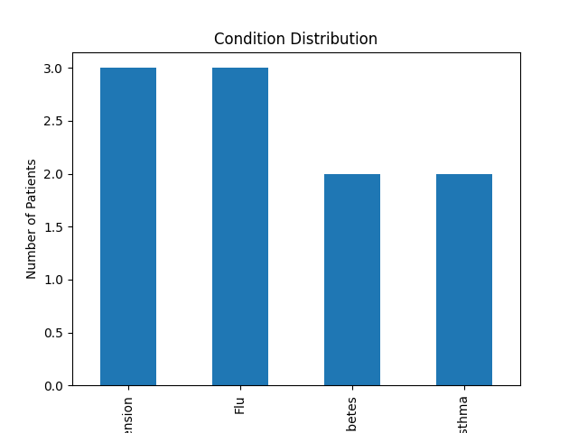
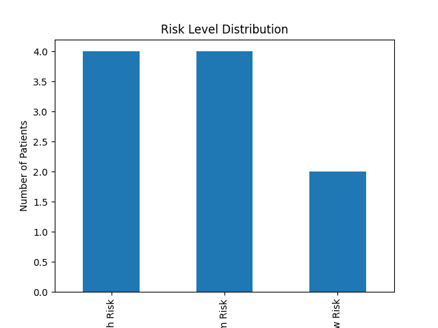
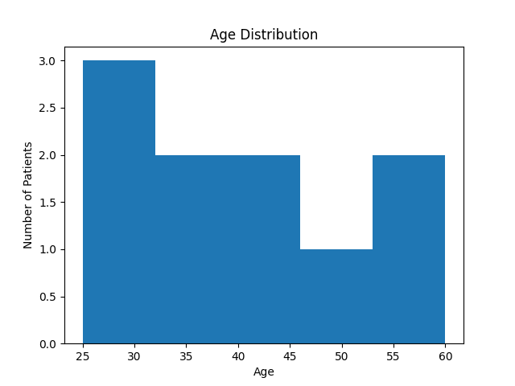

# 🏥 EMR Data Analysis System Using Python

## 📌 Project Overview
This project simulates a basic Electronic Medical Record (EMR) data analysis system using Python. It shows how patient data can be loaded, cleaned, analyzed, visualized, and summarized to support healthcare decision-making.

## 🚀 Features
- Load patient records from a CSV file
- Clean patient names, emails, gender, and condition data
- Analyze patient conditions and average age
- Classify patients into High Risk, Medium Risk, and Low Risk categories
- Generate charts for condition, risk level, and age distribution
- Export analysis results into a text report

## 🛠️ Technologies Used
- Python
- Pandas
- Matplotlib
- CSV

## 📊 Key Insights
- Total Patients: 10
- Average Age: 40.0
- Most Common Conditions: Hypertension and Flu
- High Risk Patients: 4
- Medium Risk Patients: 4
- Low Risk Patients: 2

- ## 📷 Visualizations
- The project generates the following charts:
### 📊 Condition Distribution

### 📊 Risk Level Distribution

### 📊 Age Distribution

## 📂 Project Files
- `emr_capstone.py` — Main Python script
- `patients.csv` — Patient dataset
- `analysis_report.txt` — Generated analysis report
- `.png files` — Generated charts

## 🎯 What I Learned
- How to load healthcare data using Pandas
- How to clean messy patient data
- How to perform basic EMR data analysis
- How to classify patient risk levels using Python logic
- How to create visualizations with Matplotlib
- How to export analysis results into a report
- Structuring a complete data analysis workflow  

- ## ✍️ Author: [Kehinde Onifade](https://github.com/KennyOnifade)
